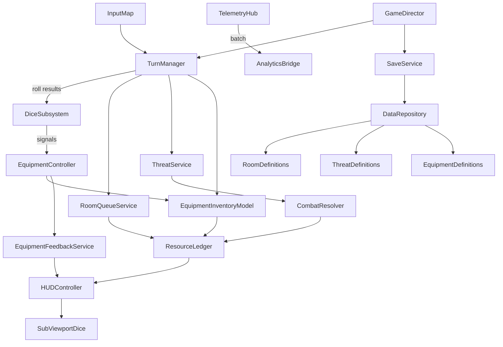
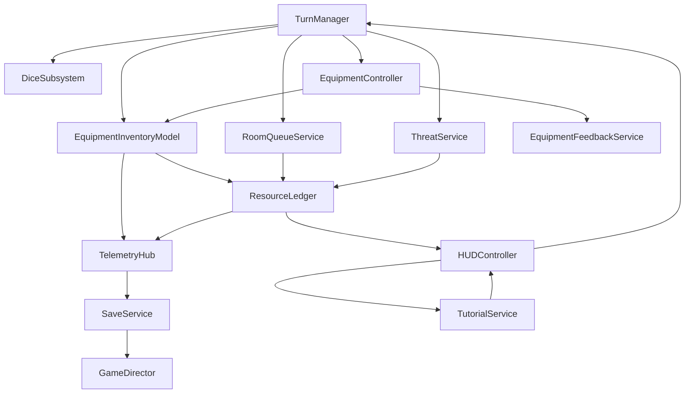
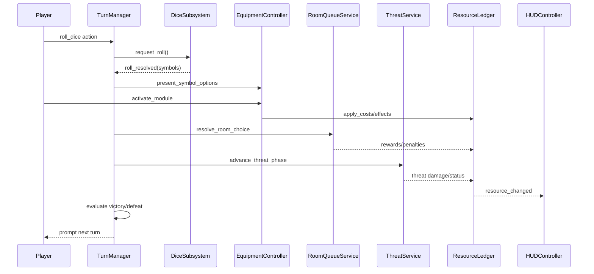
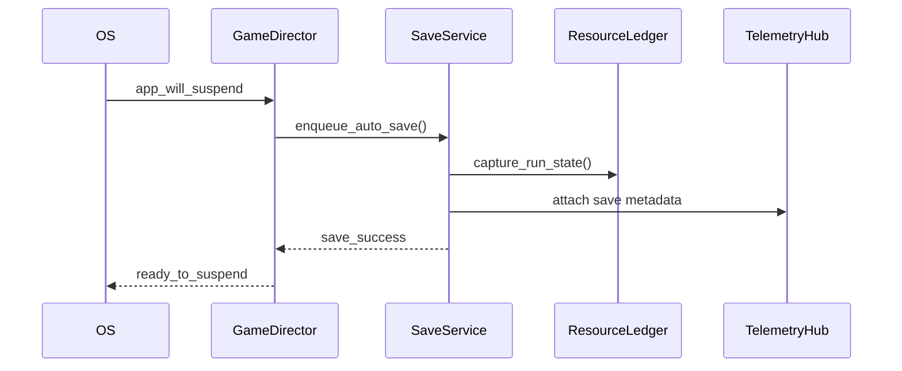

# Bermuda Sector Game Architecture Document

## Introduction
This document outlines the complete technical architecture for Bermuda Sector, a mobile-first roguelike built with Godot 4.5 using a pure statically typed GDScript codebase. It merges the Product Requirements Document and UI/UX specification into a cohesive engineering blueprint that enforces 60+ FPS performance, modular content updates, and mandatory TDD practices. Architectural decisions prioritize the tension-heavy dice loop, Arkham-inspired exploration, and mobile accessibility goals defined in the planning artifacts.

### Starter Template or Existing Project
No existing Godot starter, template, or prior codebase has been identified. This architecture assumes a greenfield Godot 4.5 project configured from scratch, including project settings, folder scaffolding, and addon installation.

### Change Log
| Date | Version | Description | Author |
| --- | --- | --- | --- |
| 2025-10-03 | v0.1 | Initial architecture baseline capturing dice loop, room/threat systems, equipment matrix, UX alignment, and performance strategy. | Dan (game-architect) |
| 2025-10-06 | v0.2 | Equipment matrix systems blueprint (inventory model, feedback pooling, telemetry contracts). | Dan (game-architect) |

## High Level Architecture
### Technical Summary
Bermuda Sector adopts a composition-first Godot 4.5 architecture targeting Android and iOS landscape devices. Statically typed GDScript powers every subsystem—from orchestration and UI to dice simulation, combat math, save serialization, and telemetry batching—favoring language consistency and maintainability. Core patterns leverage scene composition, signal-driven communication, Resource-authored content, and SubViewport bridging for 3D dice atop a 2D HUD. Continuous profiling, object pooling, and TDD (GUT) guard the 60+ FPS requirement while supporting the PRD’s push-your-luck pacing and the UX spec’s clarity goals.

### High Level Overview
1. **Architectural Style** – Modular scenes composed into lightweight coordinators (`TurnManager`, `HUDController`); autoload singletons orchestrate cross-system signals. 2D HUD overlays a 3D dice SubViewport.  
2. **Language Strategy** – GDScript 2.0 (statically typed) for all gameplay, systems, tooling, and editor extensions to minimize cross-language overhead.  
3. **Repository Structure** – Single Godot project under `res://` with dedicated folders for `scenes`, `scripts`, `resources`, `ui`, and `tests`.  
4. **System Architecture** – Autoloads (`GameDirector`, `TurnManager`, `ResourceLedger`, `ThreatService`, `TelemetryHub`, `SaveService`) coordinate packed scenes and custom Resources representing rooms, threats, equipment, dice.  
5. **Player Loop & InputMap** – Input actions drive the turn sequence: roll → resolve dice → trigger equipment → choose room/threat resolution → update resources → check escape/defeat → next turn. InputMap supports touch, controller, keyboard parity.  
6. **Key Decisions** – Forward+ renderer (adaptive quality tiers), 2D physics for HUD interactions, isolated 3D physics in dice SubViewport, official export templates, Fastlane CI.  
7. **Performance Strategy** – Object pooling (dice, particles, cards), static typing, SubViewport scaling, profiling gates in CI, automated FPS tests.

### High Level Project Diagram


### Architectural and Design Patterns
- **Node Composition & PackedScenes** – Feature scenes built from modular components rather than deep inheritance, enabling rapid content swaps and reducing technical debt.  
- **Signal-Oriented Coordination via Autoloads** – Explicit signal wiring keeps systems decoupled while avoiding opaque global event buses. TurnManager and ResourceLedger act as primary hubs.  
- **Resource-Driven Content Authoring** – Custom Resources (`RoomCardResource`, `ThreatProfileResource`, `EquipmentModuleResource`, etc.) power data-driven iteration and editor tooling support.  
- **Single-Language Discipline** – Keep gameplay, tooling, and performance code in statically typed GDScript to streamline reviews, onboarding, and profiling.  
- **Object Pooling & Deferred Instancing** – All transient VFX and dice instances pulled from pools to prevent mobile GC spikes.  
- **Mandatory TDD Pipeline** – GUT (GDScript) enforces red-green-refactor with CI gates; performance harnesses supplement unit coverage.

## Tech Stack
### Platform Infrastructure
- **Target Platforms:** Android 13+ (primary), iOS 16+ (secondary)  
- **Primary Platform:** Android 13+ landscape devices  
- **Platform Services:** Google Play Games Services, Apple Game Center, platform crash reporters  
- **Distribution:** Google Play Closed Track → Apple TestFlight → Global release

### Technology Stack Table
| Category | Technology | Version | Purpose | Rationale |
| --- | --- | --- | --- | --- |
| **Game Engine** | Godot | 4.5.0-stable | Core runtime | Matches PRD expectations, Forward+ upgrades, active support |
| **Primary Language** | GDScript | 2.0 (static typed) | Game orchestration, UI, content glue | Fast iteration, editor-native tooling, static typing for perf |
| **Performance Practices** | Typed GDScript Patterns | 2.0 | Dice physics, combat math, saves, analytics batching | Static typing, profiling discipline, avoids runtime allocations |
| **Renderer Profile** | Forward+ | Custom `.tres` | Hybrid 2D HUD + 3D dice | Dynamic lighting options with downgrade path |
| **Physics 2D** | Godot Physics 2D | 4.5.0 | HUD drag/drop, collision sensing | Deterministic, lightweight |
| **Physics 3D** | Godot Physics 3D | 4.5.0 | Dice simulation | Runs in isolated SubViewport |
| **Input System** | InputMap | Built-in | Cross-platform controls | Action-based, supports touch/controller/keyboard |
| **UI Theme** | `base_theme.tres` | N/A | Styling & accessibility palettes | Quick palette swaps and scaling |
| **Data Authoring** | Custom Resources | N/A | Rooms, threats, gear, tutorials | Editor-native, hot-reload |
| **Analytics Bridge** | OpenGameAnalytics | 1.2.0 | Gameplay telemetry | Self-hosted, privacy-aligned |
| **Crash Reporting** | Sentry Godot SDK | 1.5.2 | Crash/error capture | Lightweight mobile support |
| **GDScript Testing** | GUT | 9.2.0 | Unit/integration tests | Mandatory TDD for GDScript systems |
| **Performance Testing** | Godot Performance Test Kit | 0.6.0 | Automated FPS budget checks | Validates 60+ FPS gate in CI |
| **Build Automation** | Fastlane | 2.221.1 | Mobile build & signing | Integrates with CI runners |
| **CI/CD** | GitHub Actions | Hosted | Automated builds/tests | Tag-driven releases, secrets management |
| **Localization** | Godot Localization System | Built-in | Future-proof text scaling | Supports accessibility goals |
| **Cloud Storage (Phase 2)** | AWS S3 + Cognito | Service | Meta progression sync | Aligns with PRD roadmap |

## Game Data Models
### RoomCardResource
**Purpose:** Defines discoverable rooms, including difficulty, rewards, and threat hooks.  
**Key Attributes:** `room_id: StringName`, `display_name: String`, `difficulty_rating: int`, `tags: Array[StringName]`, `reward_table: Array[RewardEntry]`, `threat_spawns: Array[StringName]`.  
**Relationships:** References `ThreatProfileResource` entries for spawnable enemies and `EquipmentModuleResource` for guaranteed rewards.  
**Resource Implementation:** Custom Resource in GDScript stored at `res://resources/rooms/`; preload active decks, stream optional packs when unlocked.

### ThreatProfileResource
**Purpose:** Describes latched threats, timers, dice faces, status effects, and rewards.  
**Key Attributes:** `threat_id`, `display_name`, `attack_timer`, `dice_faces`, `status_effects`, `defeat_rewards`.  
**Relationships:** Links to `DiceFaceSetResource` and `StatusEffectResource`.  
**Implementation:** GDScript Resource in `res://resources/threats/`; preload baseline threats, load advanced variants on demand.

### EquipmentModuleResource
**Purpose:** Represents inventory modules with shapes, dice costs, and effects.  
**Key Attributes:** `module_id`, `display_name`, `shape`, `dice_cost`, `effects`, `cooldown_turns`.  
**Relationships:** Connects to `DiceFaceSetResource` for compatibility and `StatusEffectResource` for buffs/debuffs.  
**Implementation:** GDScript Resource stored in `res://resources/equipment/`; load baseline modules at boot, stream rares post-unlock.

### EquipmentMatrixConfigResource
**Purpose:** Defines grid dimensions, burden thresholds, and dice slot bindings for the equipment matrix.  
**Key Attributes:** `grid_width: int`, `grid_height: int`, `base_burden: int`, `thresholds: Dictionary[StringName, EquipmentBurdenThreshold]`, `slot_bindings: Dictionary[StringName, Array[StringName]]`, `rotation_rules: Dictionary[StringName, bool]`, `cell_labels: Array[StringName]`.  
**Relationships:** Consumed by `EquipmentInventoryModel` and `EquipmentController` to validate placements and update burden/slot rules.  
**Implementation:** GDScript Resource at `res://resources/config/equipment_matrix.tres`; hot-reloaded via config watcher for balancing.

### EquipmentLoadoutResource
**Purpose:** Persists the player’s current equipment layout within saves and previews.  
**Key Attributes:** `placed_modules: Array[EquipmentPlacement]`, where `EquipmentPlacement` stores `module_id: StringName`, `origin: Vector2i`, `orientation: EquipmentOrientation`, `occupied_cells: PackedVector2Array`, `bound_slots: Array[StringName]`.  
**Relationships:** Embedded within `RunStateResource` and surfaced through `EquipmentInventoryModel`.  
**Implementation:** GDScript Resource at `res://resources/run_state/equipment_loadouts/`; serialization handled by `SaveService`.

### DiceFaceSetResource
**Purpose:** Configures dice pools for players/threats.  
**Key Attributes:** `set_id`, `faces`, `lock_rules`, `refresh_strategy`.  
**Relationships:** Referenced by `ThreatProfileResource` and `EquipmentModuleResource`.  
**Implementation:** GDScript Resource in `res://resources/dice/` optimized with typed arrays and preallocated pools; preload player sets, lazy-load enemy variants.

### StatusEffectResource
**Purpose:** Reusable status definitions (bleed, oxygen leak, dice lock).  
**Key Attributes:** `effect_id`, `duration_type`, `magnitude`, `ui_icon`, `stack_rules`.  
**Implementation:** GDScript Resource in `res://resources/status_effects/`; preload entire list for responsiveness.

### RunStateResource
**Purpose:** Serializable snapshot of an active run.  
**Key Attributes:** `player_resources`, `dice_pools`, `room_queue_state`, `active_threats`, `equipment_layout`.  
**Relationships:** Embeds references to rooms, threats, equipment, and status effects.  
**Implementation:** GDScript Resource at `res://resources/run_state/`; load on demand during saves/loads using `PackedByteArray` snapshots.

### TutorialStepResource
**Purpose:** Drives contextual onboarding prompts aligned with UX flow.  
**Key Attributes:** `step_id`, `trigger_condition`, `instruction_text`, `highlight_nodes`, `follow_up_action`.  
**Implementation:** GDScript Resource under `res://resources/tutorial/`; preload entire tutorial set.

## Game Systems & Components
### TurnManager System
**Responsibility:** Orchestrates turn phases (roll, symbol resolution, threats, resource updates).  
**Key Components:** `turn_manager` autoload (Node), `dice_roll_resource` data, `game_director` autoload.  
**Language:** GDScript (statically typed) for coordination and dice orchestration.  
**Implementation:** Processes run in `_process`; emits `turn_started`, `dice_committed`, `threat_phase`, `turn_completed`; depends on DiceSubsystem, RoomQueueService, ThreatService, ResourceLedger; pulls pooled popups for roll feedback.

### DiceSubsystem
**Responsibility:** Handles dice physics, symbol calculation, exhaustion/refresh pools.  
**Key Components:** `dice_subsystem` Node3D (SubViewport), `dice_face_set` Resource, `dice_pool_cache` autoload.  
**Language:** GDScript (statically typed) driving Godot Physics 3D for deterministic dice rolls.  
**Implementation:** Uses `_physics_process`; emits `roll_resolved`, `dice_locked_changed`; pools rigid bodies for dice and particles while avoiding per-frame allocations.

### RoomQueueService
**Responsibility:** Manages room decks, queue replenishment, mini-objectives.  
**Key Components:** `room_queue_service` autoload, `room_card_resource`, `deck_config_resource`.  
**Language:** GDScript.  
**Implementation:** Signal-driven with timers; emits `room_queue_updated`, `room_selected`, `mini_objective_spawned`; uses HUD pools for card previews.

### ThreatService
**Responsibility:** Spawns and updates threats, runs attack timers, resolves combat/evasion.  
**Key Components:** `threat_service` autoload, `threat_profile_resource`, `combat_resolver` utility.  
**Language:** GDScript for coordination and combat math with deterministic helper functions.  
**Implementation:** `_process` timers, signal emissions, pooled VFX.

### EquipmentController
**Responsibility:** Handles inventory grid, module activation, cooldowns, dice costs.  
**Key Components:** `equipment_controller` Control, `equipment_module_resource`, `equipment_inventory_model` autoload.  
**Language:** GDScript.  
**Implementation:** `_gui_input` drag/drop, `_process` cooldown UI, pooled tooltips.

### EquipmentInventoryModel
**Responsibility:** Autoload that owns canonical equipment state, burden math, and dice slot bindings.  
**Key Components:** `equipment_inventory_model` autoload (Node), `EquipmentMatrixConfigResource`, `EquipmentLoadoutResource`, optional `grid_packer` utility.  
**Language:** GDScript (statically typed) for state management; exposes lightweight API consumable by UI and gameplay systems.  
**Implementation:** Maintains occupancy bitmap (`PackedByteArray`) per grid cell, caches module masks, enforces burden thresholds, and emits `loadout_changed(loadout: EquipmentLoadoutResource)`, `burden_changed(total_burden: int, state: EquipmentBurdenState)`, `dice_binding_updated(slot: StringName, module_id: StringName)`. Interacts with `ResourceLedger` to apply burden penalties and `TelemetryHub` for equipment analytics.

### EquipmentFeedbackService
**Responsibility:** Pools audiovisual feedback (highlights, toasts, haptics) for equipment interactions.  
**Key Components:** `equipment_feedback_service` Node (autoload under UI layer), pooled `ColorRect` overlays, `AudioStreamPlayer` instances, platform haptic bridge.  
**Language:** GDScript (statically typed).  
**Implementation:** Exposes `show_valid_preview(cells: PackedVector2Array)`, `show_invalid_preview(conflicts: PackedVector2Array)`, `play_action_feedback(type: EquipmentFeedbackType)`. Integrates with `HUDController` for overlay positioning and throttles haptics to 60 Hz to avoid battery drain.

### GridPacker Utility (Optional)
**Responsibility:** Performance-focused placement validator for complex module masks.  
**Key Components:** `grid_packer` class (`res://scripts/utils/grid_packer.cs`) compiled via Godot C#.  
**Language:** C# (partial class) with span-based iteration to avoid allocations.  
**Implementation:** Offers `Fits(bool[,] grid, bool[,] mask, Vector2I origin)` and `Rasterize(PackedVector2Array mask)` helpers; only enabled on mobile builds that hit 0.8 ms validation ceiling, falling back to GDScript otherwise.

### ResourceLedger
**Responsibility:** Central authority for resources (health, oxygen, materials, threat, XP).  
**Key Components:** `resource_ledger` autoload, `resource_ledger_data` Resource, `alert_policy_resource`.  
**Language:** GDScript.  
**Implementation:** Signal-based updates, no pooling needed.

### HUDController
**Responsibility:** Renders and updates Run HUD, routes UI interactions.  
**Key Components:** `run_hud` Control, `resource_meter`, `context_info_pane`.  
**Language:** GDScript.  
**Implementation:** `_ready` caching, `_process` animations, pooled previews.

### TelemetryHub
**Responsibility:** Buffers gameplay events, batches analytics submissions, manages privacy toggles.  
**Key Components:** `telemetry_hub` autoload, `telemetry_event_resource`, `analytics_bridge` singleton.  
**Language:** GDScript for event buffering and serialization.  
**Implementation:** `_process` flush intervals, event pooling, opt-in enforcement using JSON batching.

### SaveService
**Responsibility:** Serializes/deserializes run and meta progression, encrypts data, handles backups.  
**Key Components:** `save_service` autoload, `run_state_resource`, `encryption_policy`.  
**Language:** GDScript.  
**Implementation:** Worker thread saves via `FileAccess` APIs, buffer pools, signals for success/failure.

### TutorialService
**Responsibility:** Manages contextual tutorials, skip states, overlay presentation.  
**Key Components:** `tutorial_service` autoload, `tutorial_step_resource`, `tutorial_overlay` scene.  
**Language:** GDScript.  
**Implementation:** Signal driven, overlays via CanvasLayer, state persistence through SaveService.

### System Interaction Diagram


## Gameplay Systems Architecture
### Gameplay Systems Overview
**Core Game Loop:** Roll dice → evaluate locks/actions → resolve equipment effects → interact with room/threat → update resources/threat meter → check escape/defeat → next turn.  
**Player Actions:** Roll/reroll dice, lock symbols, spend actions to cycle rooms, explore/search, engage/evasion against threats, activate equipment modules, manage inventory layout, trigger mini-objectives.  
**Game State Flow:** `Idle → Roll Prep → Dice Resolution → Player Action Resolution → Threat Resolution → Resource Update → Victory/Defeat Check → Next Turn/Run Summary`.

### Gameplay Component Architecture
- **Player Controller Components:** `TurnManager`, `PlayerHandController`, `EquipmentController`, `EquipmentInventoryModel` – statically typed GDScript orchestrating player choices and loadout state.  
- **Game Logic Components:** `DiceSubsystem`, `RoomQueueService`, `ThreatService`, optional `GridPacker` helper – all statically typed modules focused on deterministic calculations.  
- **Interaction Systems:** `HUDController`, `TutorialService`, `TelemetryHub`, `EquipmentFeedbackService` – signal flow `TurnManager → DiceSubsystem → TurnManager` and `TurnManager → RoomQueueService/ThreatService/EquipmentInventoryModel → ResourceLedger → HUDController`.  
- **Performance Targets:** 60+ FPS (≤16.67 ms frame time) with spikes capped <4 ms.

## Node Architecture Details
### Node Patterns
- **Node Composition:** Build features from modular packed scenes (rooms, threats, equipment) assembled under lean coordinators; no bloated root nodes.  
- **Scene Inheritance:** Apply inheritance only when variants share ≥70% behavior (e.g., `BaseThreat` subclasses). Use composition for UI panels.  
- **Signal Communication:** Explicit `connect` calls in `_ready()` or via autoload registries; no global event bus.  
- **Typed GDScript Discipline:** All scene scripts and helper modules use typed GDScript with shared utility libraries for math-heavy paths.

### Resource Architecture
- **Data Architecture:** Custom Resources under `res://resources/<domain>/` with `ResourceUID` references for cross-links.  
- **Configuration Management:** Global tunables stored in `res://config/game_balance.tres`; environment overrides via JSON loaded at startup.  
- **Equipment Resources:** `res://resources/config/equipment_matrix.tres` (matrix config) consumed by `EquipmentInventoryModel`, and `res://resources/run_state/equipment_loadouts/` (player layouts) serialized within `RunStateResource`.  
- **Runtime Resources:** Transient state created by factories in SaveService; runtime caches kept in memory only.  
- **Loading Strategy:** Preload frequently used content (baseline decks, threats, equipment); stream optional packs with threaded loader during downtime.

## Physics Configuration
### Physics Settings
- 2D physics (60 FPS) for UI interactions; 3D physics isolated in SubViewport for dice.  
- Fixed timestep: 60 FPS (16.67 ms) for 2D and 3D.  
- Collision layers: 1=Interactables, 2=Cards, 3=Equipment, 4=Dice tray, 5–8 reserved.  
- Physics materials: `dice_material` (low friction/high bounce), `ui_drag_material` (high friction/no bounce).  
- Language: GDScript controls both 3D dice bodies and 2D collision checks, leveraging typed math helpers for critical paths.

### Rigidbody Patterns
- Player avatar represented by proxy nodes (no CharacterBody).  
- Dice use `RigidBody3D` with constrained axes; threat/status markers rely on `Area2D`.  
- Object pooling for rigid bodies and particle emitters.  
- Optimization: reduce solver iterations after dice settle, disable 3D processing outside roll windows.  
- Maintain 60+ FPS during physics-intensive moments.

## Input System Architecture
### Input Actions Configuration
- Actions: `roll_dice`, `confirm_action`, `cancel_action`, `lock_die`, `reroll_selection`, `open_equipment`, `open_rooms`, `navigate_left/right`, `trigger_tutorial`, `pause_menu`.  
- Categories: Turn Control, Dice Management, Navigation, System.  
- Device Support: Touch (tap, long press, drag, two-finger cancel, swipe), Gamepad (A/B/X/Y, bumpers), Keyboard/Mouse.  
- Input latency target: <50 ms.

### Input Handling Patterns
- Player input handled by `TurnManager` and `DiceSubsystem`; UI input via `_unhandled_input`; `EquipmentController` intercepts drag/drop in `_gui_input`.  
- Processing uses `is_action_just_pressed`; hold behaviors managed with timers.  
- Language: GDScript only.

## State Machine Architecture
### Game State Machine
- States: `Boot`, `MainMenu`, `Onboarding`, `RunActive`, `RunPaused`, `RunCompleted`, `MetaProgression`.  
- Transitions managed by `GameDirector` with explicit `enter/exit` hooks; triggered by HUD/TurnManager/SaveService signals.  
- Language: GDScript.

### Entity State Machines
- Player states: `Idle`, `Rolling`, `Selecting`, `Resolving`, `ThreatResponse`, `EscapeCheck` within `TurnManager`.  
- AI states: `Spawning`, `Charging`, `Attacking`, `Cooldown`, `Defeated`, `Latched` plus status sub-states handled by shared GDScript utility modules.  
- Object states: Rooms (`Hidden`, `Revealed`, `Resolved`, `Discarded`), equipment (`Inactive`, `Armed`, `CoolingDown`, `LockedOut`).  
- Signal integration ensures HUD/Telemetry receive `state_changed` events.

## UI Architecture
### UI System Selection
- Framework: Control nodes with theme system.  
- Scaling: Anchors/MarginContainers with percent offsets and minimum size.  
- Viewport: Main CanvasLayer for HUD, SubViewport for dice, overlays via additional CanvasLayers.  
- Language: GDScript for all UI logic.

### UI Navigation System
- Screen management via `UiManager` autoload; main scenes swapped with `change_scene_to_packed`.  
- Flow: Main Menu → Onboarding (optional) → Run HUD → Post-Run → Meta Progression/Main Menu.  
- Back button: Pause menu in Run HUD; overlay-specific closing; exit prompt on Main Menu.

## UI Component System
### UI Component Library
- Base components: `BasePanel`, `BaseButton`, `IconButton`, `TooltipPanel`.  
- Custom components: `ResourceMeter`, `RoomCard`, `ThreatCard`, `DiceLockTray`, `EquipmentSlot`, `ActionChip`.  
- Prefabs stored in `res://ui/components/` with scripts in parallel directories; `ComponentFactory` manages instancing/pooling.

### UI Data Binding
- Data binding via `UiStateStore` observer pattern; panels subscribe to typed signals.  
- UI events emitted from components and routed to controllers.  
- View models generated as lightweight dictionaries (`HudViewModel`, `ThreatOverlayVM`).

## UI State Management
- State persistence: Accessibility settings in `ConfigFile`; tutorial completion stored in SaveService; last tab remembered per run.  
- Screen state tracked in `UiStateStore`, with overlay stack handling modal layers.  
- UI configuration resources in `res://config/ui/` allow design tweaks without code changes.

## Scene Management Architecture
### Scene Structure
- Scenes organized under `res://scenes/core/` (main menu, run HUD, post-run), `res://scenes/gameplay/` (rooms, threats, equipment), and `res://scenes/systems/`.  
- Root `game_root.tscn` loads autoloads then initializes `MainMenu`.  
- Persistent scenes limited to autoloads (`GameDirector`, `TelemetryHub`, etc.).

### Scene Loading System
- Scene transitions via `change_scene_to_packed`; intra-HUD panels instanced/unloaded dynamically.  
- Async loading using `ResourceLoader.load_threaded_request` for decks/SubViewport warm-up; `GameDirector` gates interactions until ready.  
- `LoadingOverlay` Control displays tips and captures telemetry on wait times.

## Data Persistence Architecture
### Save Data Structure
- Save models: `RunStateResource` and `MetaProgressResource`.  
- Serialization: Binary via GDScript `FileAccess` with packed arrays, plus optional debug JSON export toggle.  
- Validation: CRC32 hash + schema version for migrations.

### Persistence Strategy
- Save triggers: end of turn, mini-objective resolution, equipment changes, app suspend/resume, run completion.  
- Auto-save: Worker thread with queued call, toasts only on manual triggers.  
- Cloud save: Phase 2 integration with AWS Cognito/S3 (stubs provided).

## Save System Implementation
### Save/Load API
- Save interface: `SaveService.save_run_state(run_state) -> SaveResult` (async).  
- Load interface: `SaveService.load_run_state(slot) -> RunStateResource?`.  
- Error handling: Try/catch with Sentry logging, backup restore attempts, user prompt on failure.

### Save File Management
- File structure: `user://saves/run_slot_01.dat`, `user://meta/meta_progress.dat`, `user://config/ui_settings.cfg`.  
- Backup strategy: Maintain two rotating backups (`.bak`).  
- Migration: Versioned migrations executed by SaveService; unknown versions prompt update message.

## Analytics Integration
### Analytics Event Design
- Event categories: Run lifecycle, dice actions, room interactions, threat encounters, equipment usage, resource thresholds, tutorial progression, performance metrics.  
- Custom events: `dice_lock_pattern`, `room_cycle_used`, `threat_timer_overflow`, `escape_attempt`, `module_combo_triggered`, `oxygen_warning_ack`.  
- Player progression: Track clue milestones, XP gains, unlock achievements.

### Analytics Implementation
- Analytics SDK: OpenGameAnalytics 1.2.0 (self-hosted endpoint).  
- Event tracking: `TelemetryHub` batches 10 events or 15 seconds, serialized via GDScript `analytics_bridge`.  
- Privacy compliance: Explicit opt-in, hashed device IDs, respect opt-out by disabling network calls.

## Rendering Pipeline Configuration
### Render Pipeline Setup
- Pipeline: Forward+ with adaptive fallback to Mobile on low-end devices.  
- Pipeline assets: `res://rendering/forward_plus.tres` and `res://rendering/mobile_low.tres`.  
- Quality settings: Performance, Balanced, Atmosphere tiers adjusting glow, shadow atlas, SubViewport resolution.

### Rendering Optimization
- Batching: Group UI layers, combine static backgrounds with `MultiMeshInstance2D`, reuse dice meshes.  
- Draw calls: Shared materials for cards, atlas textures, occlusion for hidden panels.  
- Textures: ETC2/ASTC compression, mipmaps for 3D dice, no mipmaps for UI.

## Shader Guidelines
### Shader Usage Patterns
- Built-in shaders for most UI and standard materials for dice.  
- Custom shaders limited to atmospheric overlays and dice highlights.  
- Shader variants minimized via uniform toggles.

### Shader Performance Guidelines
- Mobile optimization: Keep fragment instructions <60, avoid loops, pre-bake noise textures.  
- Performance budgets: Dice shader ≤1 ms GPU; overlays ≤0.3 ms.  
- Profiling: Use Godot profiler on target hardware; log results each milestone.

## Sprite Management
### Sprite Organization
- Atlases per category (`res://art/atlases/ui`, `rooms`, `threats`).  
- Naming: `category_descriptor_state.png`.  
- Import: Filter off for UI, on for world sprites; compression preset chosen per asset type.

### Sprite Optimization
- Compression: ETC2 (Android) / ASTC (iOS).  
- Resolution: 2048 baseline for UI atlases with runtime scaling.  
- Memory: Preload current deck/threat atlases; free unused after runs.

## Particle System Architecture
### Particle System Design
- Effect categories: Dice impacts, threat attacks, ambience, UI feedback.  
- Scene organization: `res://fx/` with pooled emitters via `ParticleManager`.  
- Pooling: GPUParticles preprocessed with emitter pooling.

### Particle Performance
- Budgets: ≤0.8 ms GPU, ≤0.5 ms CPU.  
- Mobile optimization: Limit particle counts (<200), degrade to low LOD when thermal warnings.  
- LOD strategy: Threat meter and device thermal state adjust emission rates.

## Audio Architecture
### Audio System Design
- Audio manager: `AudioDirector` autoload controlling bus routing and snapshots.  
- Audio sources: `AudioStreamPlayer3D` for spatial dice/env cues, pooled `AudioStreamPlayer` for UI.  
- 3D audio: Limited to dice and ambient hum in SubViewport.

### Audio Categories
- Music: Layered ambient score with threat-driven intensities.  
- SFX: Categories for UI, dice, room ambience, threats, equipment with pooling.  
- Voice/Dialog: Not in MVP; channel reserved.

## Audio Mixing Configuration
### Audio Mixer Setup
- Mixer groups: Master → Music, SFX, Ambience, UI, Dice, Voice(reserved).  
- Effects chain: Limiter on master, mild compressor on SFX, optional low-pass on Ambience.  
- Snapshots: `Calm`, `Alert`, `Critical` tied to threat meter.

### Dynamic Audio Mixing
- Volume control via settings UI with tweened adjustments.  
- Dynamic range: Mobile compressed option; default moderate headroom.  
- Platform optimization: 48 kHz targets; disable heavy effects on low-end devices.

## Sound Bank Management
### Sound Asset Organization
- Bank structure under `res://audio/banks/` (music, sfx, ambience, ui).  
- Loading strategy: Core banks at boot; deck/threat banks streamed during transitions.  
- Memory management: Unload rare banks post-run while caching last-used sets.

### Audio Streaming
- Streaming: `AudioStreamOggVorbis` for music with streaming flag; SFX as WAV.  
- Compression: OGG quality 0.6 for music; WAV for short cues.  
- Platform considerations: Configure OpenSL (Android) and CoreAudio (iOS); handle pause/resume gracefully.

## Godot Development Conventions
### Godot Best Practices
- Small, focused scenes; cache node references; follow `<Feature>_<Role>` naming.  
- Static typing, avoid per-frame allocations, disable processing when idle.  
- Use pools, preload frequently used assets, disconnect signals on teardown.

### Godot Workflow Conventions
- Feature work starts in isolated scenes with test harnesses.  
- Scripts limited to <200 lines; exported variables documented for designers.  
- Resources stored in domain folders, versioned when affecting saves; balance tweaks tracked via diffable files.

## External Integrations
### Google Play Games Services
- **Purpose:** Achievements (MVP), future cloud saves.  
- **Docs:** https://developers.google.com/games/services  
- **Plugin:** GodotGooglePlayGameServices 1.4.0  
- **SDK:** Android Play Services 23.x  
- **Auth:** Google Sign-In OAuth  
- **Key Features:** `Achievements` (progression rewards), `Leaderboards` (future).  
- **Implementation Notes:** Wrapped in `PlatformServices.gd`; sign-in deferred until post-tutorial.

### Apple Game Center
- **Purpose:** Achievements, platform status integration.  
- **Docs:** https://developer.apple.com/game-center/  
- **Plugin:** GodotGameCenter 1.2.1  
- **SDK:** Apple GameKit  
- **Auth:** Game Center authentication controller  
- **Features:** `Achievements`, future `Cloud Saves`.  
- **Notes:** Present onboarding-friendly modal; offline fallback supported.

### Sentry
- **Purpose:** Crash/error reporting with gameplay breadcrumbs.  
- **Docs:** https://docs.sentry.io/platforms/godot/  
- **Plugin:** SentryGodot 1.5.2  
- **SDK:** Bundled  
- **Auth:** DSN token  
- **Features:** `Breadcrumbs`, `Crash capture`.  
- **Notes:** Integrate with `TelemetryHub`; scrub PII.

### OpenGameAnalytics
- **Purpose:** Gameplay telemetry & remote config (future).  
- **Docs:** https://opengameanalytics.com/docs  
- **Plugin:** Custom REST bridge  
- **SDK:** AWS Lambda + API Gateway  
- **Auth:** HMAC-signed requests  
- **Features:** `event_submit`, `config_fetch` (phase 2).  
- **Notes:** Implement in GDScript `analytics_bridge`; respect opt-in.

## Core Game Workflows




## Godot Project Structure
```plaintext
res://
├── audio/
│   ├── banks/
│   └── streams/
├── config/
├── data/
├── fx/
├── rendering/
├── resources/
│   ├── dice/
│   ├── equipment/
│   ├── rooms/
│   ├── status_effects/
│   ├── threats/
│   └── tutorials/
├── scenes/
│   ├── core/
│   ├── gameplay/
│   └── systems/
├── scripts/
│   ├── autoload/
│   ├── gameplay/
│   ├── services/
│   ├── tutorial/
│   └── ui/
├── themes/
├── ui/
│   ├── components/
│   ├── popups/
│   └── scenes/
├── tests/
│   ├── gut/
│   └── perf/
└── project.godot
```

## Infrastructure and Deployment
- **Godot Version:** 4.5.0-stable  
- **Export Templates:** Official Android GLES3 and iOS templates pinned to 4.5.0  
- **Debug/Release:** Debug builds with profiler tools and symbols; release builds optimized and stripped  
- **Performance Validation:** Automated device-farm runs via `./scripts/godot-cli.sh` executing performance suites; fail if FPS <60 or spikes >4 ms  
- **Build Automation:** GitHub Actions (macOS + Linux) with Fastlane 2.221.1 lanes  
- **Version Control:** Git tags drive CI; semantic `vMajor.Minor.Patch`  
- **Distribution:** Internal → Google Play Closed Track → Apple TestFlight → Global  
- **Environments:**  
  - **Debug:** Developer profiling build – full logging – Android/iOS debug keys  
  - **Staging:** QA validation – telemetry to staging endpoint – stripped logs  
  - **Production:** Store submission – telemetry prod endpoint – release signatures  
- **Platform Build Settings:**  
  - Android: Target SDK 34, Min 26, `.aab` bundles, Vulkan disabled, network security config for analytics.  
  - iOS: Minimum 16.0, Metal renderer, background fetch for saves, ATS allow-list for analytics domain.

## Coding Standards (Approved)
1. Profile dice/threat loops before merge; reject changes dropping below 60 FPS at 1080p mid-tier hardware.  
2. GDScript gameplay code must be statically typed; hot paths avoid heap allocations and dynamic typing.  
3. Use object pools for dice, particles, threat visuals—no runtime instancing without profiler waiver.  
4. Write failing GUT specs (and perf harness cases) before implementation; CI blocks merges without green suites.  
5. Disconnect signals in `_exit_tree()`; avoid persistent references in autoloads without cleanup.  
6. Use `ResourceUID` for cross-asset references; no hardcoded file paths in gameplay code.

## Test Strategy
### Testing Philosophy
- Approach: Test-Driven Development with 80% minimum coverage.  
- Frameworks: GUT for GDScript plus optional GodotTestDriver for UI smoke tests.  
- Performance Tests: Automated FPS harness validating 60+ FPS.

### Godot Test Types and Organization
- **GDScript Tests (GUT):** Located in `res://tests/gut/`; cover TurnManager, RoomQueueService, ResourceLedger, tutorials, EquipmentController, and EquipmentInventoryModel (placement, burden math, slot bindings); use fixtures and doubles.  
- **Performance Harness:** Located in `res://tests/perf/`; drives automated dice-roll stress cases, equipment drag/rotate benchmarks (<0.8 ms validation), and telemetry batching checks via headless Godot.  
- **Test Data Management:** Fixtures stored in `res://tests/fixtures/`; test scenes under `res://tests/scenes/`; includes reusable equipment loadout masks and matrix configs; signal testing via GUT doubles; performance validation through automated run loops.

## Performance and Security Considerations
### Save Data Security
- Encryption: AES-256 with per-device key in secure storage.  
- Validation: CRC32 hash per save.  
- Anti-Tampering: Telemetry logging, revert to last good snapshot on mismatch.

### Platform Security Requirements
- Minimal permissions (storage access only).  
- Comply with Google Play/iOS privacy disclosures.  
- In-game privacy policy link and opt-in/opt-out controls.

### Performance Mandates
- Profile every feature; object pools for all spawned entities; throttle SubViewport when idle; enforce 60+ FPS via CI.

## Checklist Results Report
**Architecture Readiness:** High confidence overall; requires follow-up on battery profiling and asset import automation. Performance strategy, language split, and system composition align with PRD/UX constraints, but the absence of an official GDD reference introduces a documentation risk. 
- Strengths: Clear node/resource separation, explicit signal flows, mobile-first renderer strategy, and rigorous coding standards/testing pipeline.
- Gaps: No concrete battery usage test plan yet; memory ceilings and draw-call budgets need numeric targets; export automation should include validation of analytics opt-in prompts per platform.
- Actions: Define battery test methodology (thermal throttling thresholds, long-run profiling); add memory/draw-call budget tables once prototype metrics exist; document platform-specific compliance checks for analytics SDKs.

## Next Steps
- Schedule architecture review with design/product once GDD is available to validate mechanics coverage.
- Stand up Godot 4.5 project skeleton following `res://` structure, install required addons (GUT, performance harness scripts, Sentry, platform services).
- Prototype dice roll loop with pooled SubViewport dice and confirm profiling meets 60+ FPS target on Pixel 6/iPhone 13.
- Implement automated performance harness invocation in CI (GitHub Actions + Fastlane) using `scripts/godot-cli.sh`.

### Game Developer Prompt
"""
Set up the Godot 4.5 project using the structure in `docs/architecture.md`. Implement the TurnManager, DiceSubsystem, RoomQueueService, ThreatService, EquipmentController, EquipmentInventoryModel (autoload), EquipmentFeedbackService, and ResourceLedger following the signal flows defined in the architecture. Use statically typed GDScript for every subsystem—including dice physics, combat math, serialization, telemetry, and equipment placement validation—and enforce object pooling for dice, particles, threat visuals, and equipment overlays. If placement validation hits the 0.8 ms ceiling, integrate the optional `GridPacker` C# helper with accompanying unit tests. Write GUT specs and performance harness cases before implementation (TDD) and ensure the dice roll loop and equipment interactions sustain 60+ FPS on a Pixel 6/iPhone 13 using the profiling harness. Respect the approved coding standards and resource-driven content patterns.
"""
