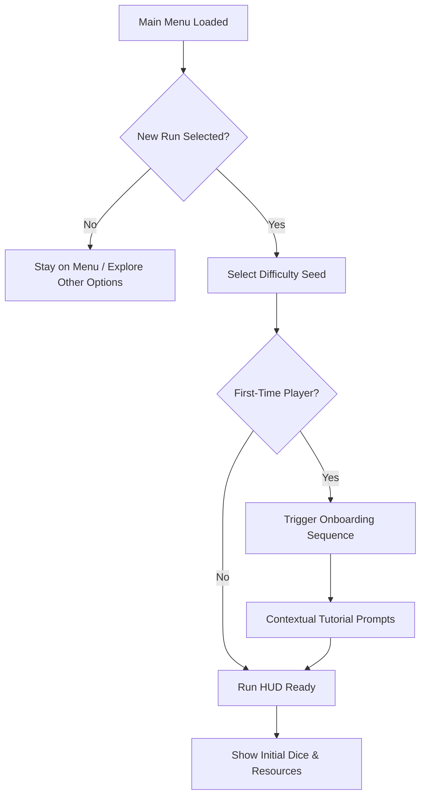
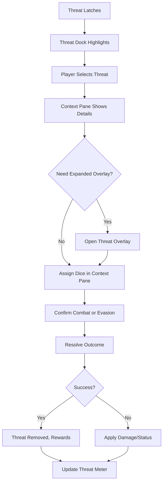
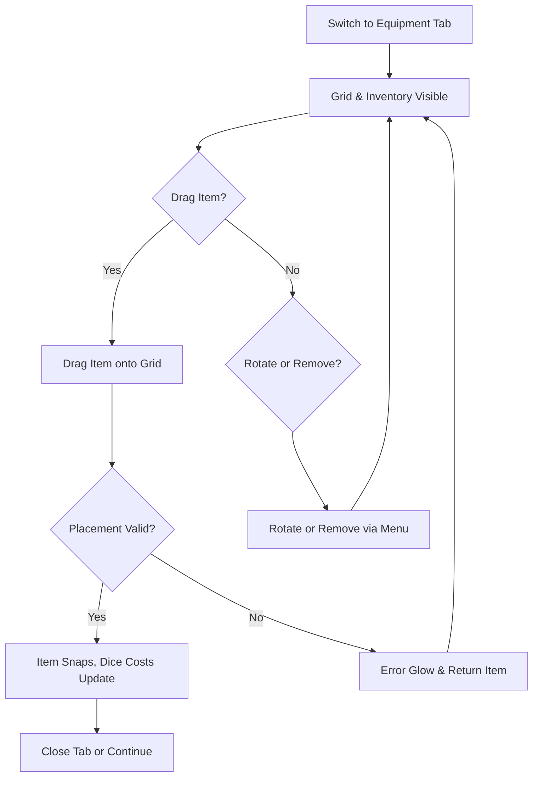

# Bermuda Sector UI/UX Specification

## Introduction
This document defines the user experience goals, information architecture, user flows, and visual design specifications for Bermuda Sector’s user interface. It serves as the foundation for visual design and frontend development, ensuring a cohesive and player-centered experience.

### Overall UX Goals & Principles
#### Target User Personas
- **Mobile Roguelike Strategist:** Plays in 10-minute sessions, expects thumb-friendly controls and fast onboarding.
- **Dice-Tactician Enthusiast:** Familiar with Arkham/Aeon’s End; demands clear odds, tooltips, and meaningful dice decisions.
- **Atmosphere Seeker:** Craves sci-fi horror immersion but needs legibility and consistent performance on mid-tier devices.

#### Usability Goals
- Understand the HUD layout and interact with dice/equipment within 2 minutes of onboarding.
- Keep all primary actions (roll, lock, confirm, cycle room) reachable with either thumb in landscape.
- Deliver visual/audio feedback for dice/resource changes within 150 ms.
- Surface accessibility toggles (text scale, color palette, vibration) within two taps from the HUD.
- Teach action economy and threat meter via contextual tutorials without lengthy text dumps.

#### Design Principles
1. **Tension with Clarity** — Convey danger and urgency without obscuring actionable information.
2. **One-Glance Readability** — Present resources, dice states, rooms, and threats simultaneously.
3. **Tactile Dice Storytelling** — Treat dice interactions like a tabletop experience with drag, lock, and exhaust feedback.
4. **Mobile-First Control Economy** — Optimize for minimal gestures, thumb reach, and short-session pacing.
5. **Accessible Atmosphere** — Maintain sci-fi horror mood while preserving contrast and scalable typography.

### Change Log
| Date       | Version | Description                  | Author              |
|------------|---------|------------------------------|---------------------|
| 2025-10-02 | v0.1    | Initial UI/UX specification. | game-ux-expert (AI) |
| 2025-10-06 | v0.2    | Equipment matrix UX updates. | game-ux-expert (AI) |

## Information Architecture (IA)
### Site Map / Screen Inventory
```mermaid
graph TD
    A[Main Menu] --> B[New Run]
    A --> C[Resume Run]
    A --> D[Codex & Lore]
    A --> E[Settings]
    A --> F[Meta Progression]

    B --> G[Onboarding Sequence]
    C --> H[Run HUD]

    G --> H
    H --> H1[Top Stats Bar]
    H --> H2[Left Dock (Rooms & Threats)]
    H --> H3[Bottom Dice Viewport & Lock Tray]
    H --> H4[Right Column Tabbed Panel]
    H --> H5[Context Info Pane]
    H --> H6[Event Resolver]
    H --> H7[Pause & Settings Overlay]

    H --> I[Post-Run Debrief]
    I --> F
    I --> A
```

### Navigation Structure
**Primary Navigation:** Main Menu → Run HUD → Post-Run Debrief. Within the Run HUD the layout is spatially organized: top stats bar, left dock for rooms/threats, bottom dice strip, right tabbed actions/equipment.

**Secondary Navigation:** Context Info Pane reveals details/actions when a room or threat is selected; overlays (Threat Detail, Event Resolver, Pause) open via buttons. Meta progression, codex, and settings remain accessible from menu and debrief.

**Breadcrumb Strategy:** Not used during runs; rely on contextual headers (e.g., threat name, room title) inside the Context Pane and overlays.

## User Flows
### Flow 1 — Run Start & Onboarding
**Player Goal:** Launch a fresh run, absorb core mechanics, and enter the Run HUD ready to act.

**Entry Scene:** `ui/scenes/MainMenu.tscn`

**Input Methods:** Touch (tap, swipe), controller buttons, keyboard

**Performance Target:** 60+ FPS throughout

**Success Criteria:** Player reaches Run HUD with tutorials understood or skipped within 90 seconds.

#### Flow Diagram


#### Edge Cases & Error Handling
- Cancel during difficulty selection returns to Main Menu without data loss.
- Tutorial skip sets completion flag but keeps prompts available in the Pause menu.
- Backgrounding during onboarding resumes at the last step.
- Resume failures fallback to a “Start New Run” dialog.

**Notes:** Tutorials provide “Teach me later” and “Don’t show again” options and log telemetry for UX tuning.

### Flow 2 — Turn Decision Loop
**Player Goal:** Execute a turn by rolling dice, managing locks, and resolving actions efficiently.

**Entry Scene:** `ui/scenes/RunHud.tscn`

**Input Methods:** Touch drag/drop, tap, long-press; controller; keyboard

**Performance Target:** 60+ FPS

**Success Criteria:** Roll → lock/reroll → confirm action within 30 seconds with clear feedback.

#### Flow Diagram
```mermaid
graph TD
    A[Start of Turn] --> B[Threat Timers Update]
    B --> C[Review Top Stats + Left Dock]
    C --> D[Press Roll]
    D --> E[Dice Physics Resolve]
    E --> F{Lock Dice?}
    F -->|Yes| G[Drag to Lock Tray]
    F -->|No| H[Leave Free]
    G --> H
    H --> I{Need Reroll?}
    I -->|Yes| J[Spend Action for Reroll]
    I -->|No| K[Select Action (Actions Tab / Context Pane)]
    J --> D
    K --> L[Preview Outcome & Exhaust Highlight]
    L --> M[Confirm Action]
    M --> N[Apply Effects & Update Resources]
    N --> O[End Turn / Trigger Threat Checks]
```

#### Edge Cases & Error Handling
- Confirm button disabled until required dice assigned; tooltip clarifies requirements.
- Insufficient actions/oxygen disables reroll with toast message.
- Drag conflicts snap dice back with gentle vibration.
- Rapid repeat rolls throttled for 0.5 s to stabilize physics.

**Notes:** Context Info Pane updates instantly when selecting rooms/threats; dice lock slots remain visible across the bottom strip.

### Flow 3 — Threat Engagement Resolution
**Player Goal:** Respond to a latched threat via combat or evasion before its timer expires.

**Entry Scene:** `ui/scenes/ThreatOverlay.tscn`

**Input Methods:** Touch, drag dice assignments, controller, keyboard

**Performance Target:** 60+ FPS even with multiple overlays queued

**Success Criteria:** Choose strategy, resolve dice, and see outcome before timer hits zero.

#### Flow Diagram


#### Edge Cases & Error Handling
- Timer reaching zero auto-resolves with warning banner.
- Minimizing overlay keeps countdown visible in threat dock badge.
- Strategy buttons disabled until required symbols present.
- Multiple threats queue in dock; badges show order and timers.

**Notes:** Overlay adds detail but the left dock and context pane remain visible for situational awareness.

### Flow 4 — Equipment Matrix Management
**Player Goal:** Reconfigure equipment matrix to optimize dice effects mid-run.

**Entry Scene:** `ui/components/EquipmentTabPanel.tscn`

**Input Methods:** Drag/drop, rotate via long-press menu or buttons, controller, keyboard

**Performance Target:** 60+ FPS

**Success Criteria:** Add/rotate/remove equipment within 20 seconds with immediate dice cost updates.

#### Flow Diagram


#### Edge Cases & Error Handling
- Full grid triggers an “Insufficient space” toast with conflicting tiles highlighted.
- Drag leaving screen auto-returns item with vibration feedback.
- On narrow widths, on-screen rotate buttons appear.
- Context Pane keeps threat timer awareness while in equipment tab.

**Notes:** Equipment grid resides in right TabContainer; dice viewport remains visible across the bottom.

#### Interaction Design & Feedback
- **Placement Preview:** Grid cells glow cyan when an item mask fits; conflicting cells pulse red at 6 Hz with haptic tick on touch devices. Preview uses a pooled `ColorRect` overlay (tint `#3FF2FF44`) that follows drag ghost.
- **Rotation:** Long-press (250 ms) opens radial mini-menu with Rotate Left/Right and Quick Remove. Keyboard/controller map to `Q/E` and bumpers. Mobile provides persistent rotate buttons below the inventory list when viewport width <1550 px.
- **Quick Remove:** Trash action in radial menu and dedicated button in Item Details panel. Removes item, refunds burden, and returns card to inventory column with slide animation (<0.15 s).
- **Invalid Placement:** Plays staccato synth beep (`sfx/ui/error_gear.wav`), flashes red outline (`#FF4747BF`), and bounces item back to inventory slot. Tooltip “Blocked by [cell labels]” appears for 1.5 s near origin.
- **Dice Binding Feedback:** Valid placement of gear with dice requirements triggers highlight on matching dice slot tags in the DiceViewport (pulsing teal border). When hovering, tooltip shows “Consumes ⚪⚪ on activation; grants +2 ⚔️”.
- **Burden Meter Response:** Meter animates increment/decrement with eased 0.18 s tween; crossing thresholds emits warning chime and banner “Overloaded: reroll costs +1 oxygen” in Context Pane.

#### Accessibility Considerations
- **Touch Targets:** Drag handles sized 64×64 px; rotate/remove buttons enlarge to 72 px when accessibility text size ≥1.2×. Hover-only affordances duplicated with on-screen buttons.
- **Color & Contrast:** Valid preview (`#3FF2FF44`) and invalid (`#FF474744`) both exceed 3:1 against grid background. Colorblind themes swap to unique patterns (diagonal hatch for invalid).
- **Text Scaling:** Item card labels wrap within 2 lines; when text scale >1.3×, inventory list switches to single-column vertical layout and grid reduces to 6×4 while enabling horizontal scroll.
- **Input Mode Hints:** Bottom status strip surfaces contextual hint (“Press L1/R1 to rotate module”). Hints adapt per active input device detected via `Input.get_connected_joypads()`.
- **Reduced Motion:** When `ui_reduce_motion` flag active, glow pulses replaced with static outline and slide animations shortened to 60 ms fade.

### Flow 5 — Post-Run Debrief & Meta Progression
**Player Goal:** Review performance, collect rewards, and choose next step.

**Entry Scene:** `ui/scenes/PostRunDebrief.tscn`

**Input Methods:** Touch, controller, keyboard

**Performance Target:** 60+ FPS

**Success Criteria:** Understand summary, claim rewards, navigate to next screen.

#### Flow Diagram
```mermaid
graph TD
    A[Run Ends (Victory/Defeat)] --> B[Post-Run Screen]
    B --> C[Outcome Summary Displayed]
    C --> D[Rewards & Unlocks Presented]
    D --> E{Rewards Claimed?}
    E -->|No| F[Prompt Claim / Auto-Claim]
    E -->|Yes| G[Enable Next Actions]
    G --> H{Next Choice}
    H -->|Start New Run| I[Return to Main Menu → New Run]
    H -->|Meta Progression| J[Open Meta Screen]
    H -->|Exit| K[Return to Main Menu]
    I --> L[Persist Data]
    J --> L
    K --> L
```

#### Edge Cases & Error Handling
- Reward claim failures offer retry and “Report Issue.”
- Post-run data saved immediately when summary appears.
- No new unlocks prompts motivational copy (“No new parts—keep exploring!”).
- Offline telemetry queues until reconnect.

**Notes:** Newly unlocked rooms/threats highlighted to encourage Codex visits.

## Wireframes & Mockups
**Primary Design Files:** Figma (link pending high-fidelity mockups)

### RunHud.tscn
**Purpose:** Core playfield aligning top stats bar, left rooms/threats dock, bottom dice viewport, and right tabbed actions/equipment with context pane.

**Control Node Hierarchy:**
```
RunHud (CanvasLayer)
├── VBoxContainer (Root)
│   ├── ResourceTopBar (HBoxContainer)
│   ├── HSplitContainer (MainBody)
│   │   ├── LeftDock (VBoxContainer)
│   │   │   ├── RoomListContainer
│   │   │   └── ThreatDock
│   │   └── RightColumn (VBoxContainer)
│   │       ├── ContextInfoPane
│   │       └── TabContainer
│   │           ├── ActionsTabPanel
│   │           └── EquipmentTabPanel
│   └── DiceViewportPane (PanelContainer)
└── PauseButton
```

**Anchoring Strategy:** Top bar full width; HSplitContainer stretches; DiceViewportPane anchored bottom full width.

**InputMap Actions:** `ui_accept`, `ui_cancel`, `ui_up/down/left/right`, `ui_lock_die`, `ui_open_equipment`, `ui_action_menu`

**Performance Impact:** Moderate (SubViewport dice).

**Theme Resource:** `res://themes/main_theme.tres`

### ThreatOverlay.tscn
**Purpose:** Detailed threat interaction modal.

**Control Node Hierarchy:**
```
ThreatOverlay (PopupPanel)
├── Header (HBoxContainer)
│   ├── Label (ThreatName)
│   └── TimerBadge
├── Body (VBoxContainer)
│   ├── TextureRect (ThreatArt)
│   ├── HBoxContainer (DamagePreview, StatusIcons)
│   └── RichTextLabel (Description)
├── StrategyTabs (HBoxContainer)
│   ├── Button (Combat)
│   └── Button (Evasion)
├── DiceAssignment (GridContainer)
└── Footer (HBoxContainer)
    ├── Button (Confirm)
    └── Button (Minimize)
```

**Anchoring Strategy:** Centered modal occupying ~80% height.

**InputMap Actions:** `ui_accept`, `ui_cancel`, `ui_left/right`

**Performance Impact:** Low.

**Theme Resource:** `res://themes/main_theme.tres`

### EquipmentTabPanel.tscn
**Purpose:** Equipment management within right tab.

**Control Node Hierarchy:**
```
EquipmentTabPanel (HSplitContainer)
├── GridContainer (Matrix 8x6)
└── VBoxContainer (InventorySide)
    ├── OptionButton (Filters)
    ├── ScrollContainer (ItemList)
    ├── VBoxContainer (ItemDetails)
    ├── PanelContainer (BurdenMeter)
    └── HBoxContainer (RotateButtons)
```

**Anchoring Strategy:** Fills right column; minimum width 420 px.

**InputMap Actions:** `ui_accept`, `ui_cancel`, `ui_open_equipment`, `ui_left/right`

**Performance Impact:** Medium (pool nodes).

**Theme Resource:** `res://themes/main_theme.tres`

#### Equipment Matrix Grid
- **Scene Path:** `res://scenes/ui/equipment_matrix.tscn`
- **Structure:** `GridContainer` hosting 8×6 `MatrixCell` Controls; cells sized 96×96 px (mobile) / 80×80 px (desktop). Safe area padding 24 px.
- **States:** Idle, ValidPreview, InvalidPreview, Occupied. StyleBoxes swapped via theme to avoid per-frame modulate calls.
- **Signals:** `cell_hovered(cell: Vector2i)`, `placement_committed(instance_id: int, origin: Vector2i)`.
- **Pooling:** Highlight overlays and drag ghost nodes pre-instanced (pool size 3) to keep drag latency <0.5 ms.
- **Performance Notes:** Placement validation runs on typed mask arrays; update throttled to every other frame while dragging to stay under 0.2 ms.

#### Equipment Item Card
- **Scene Path:** `res://scenes/ui/equipment_item_card.tscn`
- **Layout:** `HBoxContainer` with icon (64×64), title, dice cost badges, burden icons. Supports stacked trait tags (max 3) with auto-hide when text scale >1.3×.
- **States:** Inventory, DragGhost, Equipped, Disabled (locked by story). DragGhost uses semi-transparent duplicate with shader for outline.
- **Signals:** `request_rotate(module_id: String, direction: int)`, `request_remove(module_id: String)`, `hover_changed(module_id: String, is_hovering: bool)`.
- **Dice Binding Badges:** Inline icon chips referencing `DiceViewport` colors; include mini-tooltips describing effect.

#### Burden Meter & Capacity Banner
- **Scene Path:** `res://scenes/ui/equipment_burden_meter.tscn`
- **Display:** Horizontal progress bar with notches at Safe, Strained (+2 oxygen cost), Critical (locks new gear). Text readout `54/60 Load`.
- **Signals:** `threshold_crossed(new_state: String)`. Connects to `ResourceLedger` to sync oxygen surcharge messaging.
- **Accessibility:** When high contrast theme toggled, meter switches to high-con gamut `#DBFF4A / #FF3F7F`. Supports screen reader narration (“Load critical”).

#### Quick Remove & Rotation Controls
- **Radial Menu:** `PopupMenu` anchored to drag origin; options list enumerated and accepts controller navigation.
- **Persistent Buttons:** `RotateButtons` container exposes `Rotate ↺`, `Rotate ↻`, `Remove` with tooltips and Input icons when controller active.
- **Error Handling:** Attempting to remove quest-locked gear prompts confirmation dialog anchored to Item Details.

#### Inventory Filtering
- **Filters:** `OptionButton` toggles All / Offensive / Utility / Defensive / Quest. Each filter persists via `ConfigFile` under `ui/equipment`.
- **Search:** Long-press on filters opens on-screen keyboard (mobile) or text field (desktop) for module name search; autofills to highlight matching card.

#### Telemetry Hooks
- **Events:** `matrix_module_equipped`, `matrix_module_removed`, `matrix_rotation`, `matrix_invalid_attempt`.
- **Payload:** Module ID, orientation, burden delta, device input type, time since turn start. Routed through `TelemetryHub` to backend.
- **Usage:** Supports A/B tests on onboarding prompts and balancing.

### EventResolver.tscn
**Purpose:** Narrative choice interface triggered by rooms/events.

**Control Node Hierarchy:**
```
EventResolver (PopupPanel)
├── Header (VBoxContainer)
│   ├── Label (RoomTitle)
│   └── Label (DifficultyIcons)
├── ScrollContainer
│   └── VBoxContainer (NarrativeBody)
│       ├── RichTextLabel (StoryText)
│       └── FlowContainer (OutcomeBadges)
├── ChoiceButtons (VBoxContainer)
│   ├── Button (OptionA)
│   ├── Button (OptionB)
│   └── Button (OptionC)
└── CostsRow (HBoxContainer)
    ├── IconLabel (TimeCost)
    ├── IconLabel (OxygenCost)
    └── IconLabel (ThreatImpact)
```

**Anchoring Strategy:** Center overlay (75% width, 70% height).

**InputMap Actions:** `ui_accept`, `ui_cancel`, `ui_up/down`

**Performance Impact:** Low.

**Theme Resource:** `res://themes/main_theme.tres`

### PostRunDebrief.tscn
**Purpose:** Run summary, rewards, and next-step navigation.

**Control Node Hierarchy:**
```
PostRunDebrief (Control)
├── MarginContainer
│   └── VBoxContainer
│       ├── Label (OutcomeTitle)
│       ├── HBoxContainer (StatsColumns)
│       │   ├── VBoxContainer (RunStats)
│       │   ├── VBoxContainer (Rewards)
│       │   └── VBoxContainer (Unlocks)
│       └── HBoxContainer (Actions)
│           ├── Button (StartNewRun)
│           ├── Button (MetaProgression)
│           └── Button (ExitToMenu)
└── Button (ShareSummary)
```

**Anchoring Strategy:** Center with responsive margins.

**InputMap Actions:** `ui_accept`, `ui_cancel`, `ui_left/right`

**Performance Impact:** Low.

**Theme Resource:** `res://themes/main_theme.tres`

## Godot UI Component Library
### Approach
**Godot UI Approach:** Responsive Control-based HUD with top stats bar, left rooms/threats dock, bottom dice viewport, and right tabbed actions/equipment, ensuring critical elements remain visible.

**Theme Strategy:** Shared base theme with StyleBox overrides managed via `ThemeDB`; maintain unified palette and minimal draw calls.
- Base Theme: `res://themes/base_theme.tres`
- Theme Overrides: `main_theme`, `high_contrast_theme`, colorblind variants

**Language Choice:** GDScript with static typing
- Rationale: Enables fast iteration while meeting performance needs.

### Core Components
#### ResourceMeter
**Scene Path:** `res://ui/components/ResourceMeter.tscn`

**Purpose:** Display HP, Oxygen, Materials, Clues, XP in top stats bar with thresholds.

**Control Type:** TextureProgressBar inside HBoxContainer

**Signals:**
- `threshold_crossed(resource_name: String, level: String)`
- `value_changed(new_value: int)`

**Export Variables:**
- `@export var resource_name: String`
- `@export var warning_threshold: float`
- `@export var critical_threshold: float`

**States:** Normal, Warning, Critical

**Performance:** Cached textures; negligible overhead.

**Usage Guidelines:** Connect to game state manager; maintain icon + value alignment.

#### ThreatCard
**Scene Path:** `res://ui/components/ThreatCard.tscn`

**Purpose:** Represent latched threats in left dock with timer and status icons.

**Control Type:** Toggle Button with VBoxContainer

**Signals:**
- `threat_selected(threat_id: int)`
- `threat_timer_expired(threat_id: int)`

**Export Variables:**
- `@export var threat_id: int`
- `@export var attack_interval: float`

**States:** Idle, Highlighted, Warning

**Performance:** Timer via AnimationPlayer; minimal cost.

**Usage Guidelines:** Always visible; selection updates Context Pane.

#### RoomCard
**Scene Path:** `res://ui/components/RoomCard.tscn`

**Purpose:** Display active rooms with difficulty, rewards, and actions.

**Control Type:** Button with VBoxContainer

**Signals:**
- `room_selected(room_id: int)`
- `room_context_requested(room_id: int)`

**Export Variables:**
- `@export var room_id: int`
- `@export var difficulty: int`

**States:** Default, Selected, Locked

**Performance:** Reuses icon atlases; minimal overhead.

**Usage Guidelines:** Pair with Context Pane for actions (Explore, Prepare, Cycle).

#### DiceViewportPane
**Scene Path:** `res://ui/components/DiceViewportPane.tscn`

**Purpose:** Embed 3D dice viewport with lock tray and exhaust preview.

**Control Type:** PanelContainer

**Signals:**
- `dice_dragged(die_id: int, to_lock: bool)`
- `exhaust_preview_updated(dice_ids: Array)`

**Export Variables:**
- `@export var viewport_size: Vector2 = Vector2(1280, 360)`

**States:** Rolling, Locked, Exhaust Preview

**Performance:** SubViewport redraws only on rolls; ensures 60 FPS budget.

**Usage Guidelines:** Anchored bottom full width; lock slots sized 72 px for touch precision.

#### LockedDiceSlot
**Scene Path:** `res://ui/components/LockedDiceSlot.tscn`

**Purpose:** Represent locked dice beneath viewport.

**Control Type:** PanelContainer

**Signals:**
- `slot_cleared(slot_index: int)`
- `dice_hovered(die_id: int)`

**Export Variables:**
- `@export var slot_index: int`

**States:** Empty, Occupied, Exhaust-highlight

**Performance:** Shader edge toggled via uniform; no polling.

**Usage Guidelines:** Tap to release; highlight when die will exhaust on confirm.

#### ActionTabPanel
**Scene Path:** `res://ui/components/ActionTabPanel.tscn`

**Purpose:** Host primary actions (Roll, Reroll, Confirm, Scout, Prep).

**Control Type:** VBoxContainer inside TabContainer

**Signals:**
- `action_triggered(action_name: String)`
- `action_long_press(action_name: String)`

**Export Variables:**
- `@export var disabled_actions: Array[String]`

**States:** Enabled, Disabled, Cooldown

**Performance:** Shared theme; negligible overhead.

**Usage Guidelines:** Keep buttons thumb-accessible; show action costs inline.

#### EquipmentTabPanel
**Scene Path:** `res://ui/components/EquipmentTabPanel.tscn`

**Purpose:** Manage equipment grid and inventory list within tab.

**Control Type:** HSplitContainer

**Signals:**
- `slot_dropped(item_id: int, grid_pos: Vector2i)`
- `item_rotated(item_id: int, direction: int)`

**Export Variables:**
- `@export var grid_columns: int = 8`
- `@export var grid_rows: int = 6`

**States:** Normal, PlacementInvalid

**Performance:** Pools grid tiles; throttles layout updates.

**Usage Guidelines:** Keep Context Pane visible; show dice cost badges on items.

#### ContextInfoPane
**Scene Path:** `res://ui/components/ContextInfoPane.tscn`

**Purpose:** Display selected room/threat details with inline actions.

**Control Type:** PanelContainer

**Signals:**
- `context_action(action_id: String)`
- `context_dismissed()`

**Export Variables:**
- `@export var context_type: String`

**States:** Hidden, RoomContext, ThreatContext

**Performance:** Instanced content; updates on selection only.

**Usage Guidelines:** Auto-expand on selection; provide quick actions like Explore/Evade.

#### ResourceTopBar
**Scene Path:** `res://ui/components/ResourceTopBar.tscn`

**Purpose:** Horizontal top stats strip.

**Control Type:** HBoxContainer

**Signals:**
- `resource_hovered(resource_name: String)`

**Export Variables:**
- `@export var meters: Array[NodePath]`

**States:** Normal

**Performance:** Updates only on value change.

**Usage Guidelines:** Maintain safe margins; include threat/clue badges.

#### ThreatDock
**Scene Path:** `res://ui/components/ThreatDock.tscn`

**Purpose:** Stack of ThreatCards with scroll fallback.

**Control Type:** VBoxContainer inside ScrollContainer

**Signals:**
- `threat_order_changed(order: Array[int])`

**Export Variables:**
- `@export var max_visible: int = 4`

**States:** Normal, Overflow

**Performance:** Scrollbars hidden until needed; reuses card scenes.

**Usage Guidelines:** Always visible in left column; highlight active threat card.

## Game Visual Style Guide
### Visual Identity
**Game Art Style:** Retro-futurist sci-fi horror console with glitch accents; sleek HUD panels layered over distressed textures.

**Godot Theme Resources:**
- Main Theme: `res://themes/main_theme.tres`
- Dark Theme: `res://themes/dark_theme.tres`

**StyleBox Resources:**
- Panel: `res://themes/styles/panel_glass_style.tres`
- Button: `res://themes/styles/button_halation_style.tres`

### Color Palette
| Color Type | Hex Code | Usage |
|------------|----------|-------|
| Primary | #0E1A2A | HUD backgrounds, top bar |
| Secondary | #1F4D60 | Dividers, tab headers |
| Accent | #7AF7FF | Active highlights, lock glow |
| Success | #54ED9E | Positive outcomes |
| Warning | #FFC042 | Threat escalation, low oxygen |
| Error | #FF3B47 | Damage alerts, invalid placement |
| Neutral | #C7D0DA / #70808F / #1A2533 | Text, borders, subdued surfaces |

### Typography
- **Primary:** `res://fonts/Orbitron-Regular.ttf`
- **Secondary:** `res://fonts/Inter-Regular.ttf`
- **Monospace:** `res://fonts/ShareTechMono-Regular.ttf`

**Dynamic Font Settings:** Use Mipmaps=true, Antialiasing=true, Hinting=Light.

**Type Scale:**
| Element | Size | Weight | Line Height |
|---------|------|--------|-------------|
| H1 | 40 px | Bold | 44 px |
| H2 | 32 px | SemiBold | 36 px |
| H3 | 24 px | Medium | 28 px |
| Body | 18 px | Regular | 24 px |
| Small | 15 px | Regular | 20 px |

### Iconography
**Icon Atlas:** `res://ui/icons/icon_atlas.png`

**Icon Sizes:** Small 24×24, Medium 36×36, Large 64×64

**Texture Import Settings:** Filter=Linear, Mipmaps=Generate

**Usage Guidelines:** Bold silhouettes with 2 px stroke tied to resource colors; avoid semi-transparent gradients.

### Spacing & Layout
**Container System:** MarginContainer padding 32/24 px; H/V separation 16 px; equipment grid eight columns.

**Anchor Presets:** Top bar full rect; left dock left-anchored; dice strip bottom full; right tab column right-anchored with minimum width.

**Spacing Scale:** 8 px increments (8, 16, 24, 32, 48).

**Safe Area Margins:** 48 px sides, 64 px bottom for mobile landscape gesture bars.

## Game Accessibility Requirements
### Compliance Target
**Standard:** WCAG 2.1 AA-inspired guidelines tailored for mobile games.

**Godot Accessibility Features:** InputMap remapping, theme-based high contrast, DynamicFont scaling, 60+ FPS commitment.

### Key Requirements
**Visual:** Contrast ≥4.5:1 (text) and ≥3:1 (icons); focus StyleBox glow; text size range 14–28 px; colorblind themes for Deuteranopia/Protanopia/Tritanopia.

**Interaction:** Full keyboard and gamepad navigation; touch targets ≥48×48 px; destructive actions require 2 s hold; input buffer 6 frames (~100 ms).

**Performance:** Accessibility toggles maintain 60 FPS; focus indicators reuse StyleBoxes; theme swaps preloaded.

### Testing Strategy
- Verify InputMap coverage across touch/keyboard/controller.
- Validate contrast via automated shader and manual review.
- Profile HUD with high-contrast and large-text modes enabled.
- Use Godot UI debug overlay to confirm touch target sizes.
- QA run on low-end device with accessibility features toggled.

## Godot UI Responsiveness Strategy
### Viewport Configuration
**Project Settings:** Base 1920×1080, Stretch Mode `canvas_items`, Stretch Aspect `keep`.

| Resolution | Aspect | Platform | UI Scale |
|------------|--------|----------|----------|
| 1280×720   | 16:9   | Mobile   | 0.75× |
| 1920×1080  | 16:9   | Mobile/Desktop | 1.0× |
| 2340×1080  | 19.5:9 | Mobile   | 1.0× (letterboxed safe area) |
| 2560×1440  | 16:9   | Desktop  | 1.25× |

### Godot UI Adaptation Patterns
**Anchor Presets:** Mobile uses full-width anchors for top bar and dice strip; left/right columns anchored to edges with responsive margins. Desktop widens margins to 64 px; ultra-wide stretches docks proportionally while keeping dice strip centered via SizeFlags.

**Container Adjustments:** Mobile uses top `HBoxContainer`, middle `HSplitContainer`, bottom dice pane. Ultra-wide increases left dock flex to preserve touch targets; right TabContainer keeps minimum width 420 px. Tablets/desktops add separation and allow tabs to display both Actions and Equipment with left-aligned tabs.

**Control Visibility:** Hide auxiliary controls on narrow mobile; compress Context Pane header to icon under 400 px width; auto-enable ThreatDock scrolling when more than four threats.

**Font Scaling:** DynamicFont sizes scale by factor 0.9–1.3 based on viewport width, ensuring body text ≥16 px at 1280 width.

**Performance:** Adjust layout on `NOTIFICATION_RESIZED` only; batch updates via `call_deferred()` to avoid frame spikes.

## Godot UI Animation & Transitions
### Motion Principles
- Use AnimationPlayer for sequences and Tweens for simple property changes.
- Keep animations under 0.3 s; offer reduced-motion toggle (animation_speed = 0).
- Maintain 60 FPS; ensure motion direction matches panel location (context pane slides from right, dock from left).

### Key UI Animations
- **DiceRollImpact:** AnimationPlayer shaking SubViewport (0.2 s, Trans.QUAD, disable-able).
- **DiceLockSnap:** Tween scaling + edge glow (0.12 s, Trans.CUBIC, disable-able).
- **ContextPaneReveal:** AnimationPlayer slide/fade (0.18 s, Trans.QUAD, disable-able).
- **ThreatTimerPulse:** Tween modulate/scale when timer <3 s (0.3 s loop, Trans.SINE, disable-able).
- **TabSwitch:** AnimationPlayer cross-fade between tabs (0.15 s, Trans.LINEAR, disable-able).

## UI Performance Requirements
### Performance Goals
- 60+ FPS (frame time <16.67 ms) on target devices.
- Run HUD load <2.5 s; overlays <0.5 s.
- Input response <50 ms.
- Additional draw calls ≤18.
- Active Control nodes ≤90 on Run HUD.
- Active StyleBoxes ≤8 per theme variant.

### Godot UI Optimization Strategies
**Node Optimization:** Instance reusable components; keep overlays hidden instead of recreating; pool modals/tooltips.

**Rendering Optimization:** Share StyleBoxes/textures; use NinePatchRect for scalable panels; keep SubViewport HDR off.

**Update Optimization:** Drive updates via signals; batch stat changes per frame; limit shader toggles to state changes.

**Language Choice:** Statically typed GDScript for UI and supporting helpers; optimize via typed arrays and pooled data structures before considering engine-level changes.

## Godot UI Implementation Guide
### UI Scene Organization
```
res://
├── ui/
│   ├── scenes/
│   │   ├── main_menu.tscn
│   │   ├── run_hud.tscn
│   │   ├── threat_overlay.tscn
│   │   ├── event_resolver.tscn
│   │   └── post_run_debrief.tscn
│   ├── components/
│   │   ├── resource_meter.tscn
│   │   ├── room_card.tscn
│   │   ├── threat_card.tscn
│   │   ├── dice_viewport_pane.tscn
│   │   ├── action_tab_panel.tscn
│   │   ├── equipment_tab_panel.tscn
│   │   └── context_info_pane.tscn
│   └── popups/
│       ├── tutorial_prompt.tscn
│       └── confirmation_dialog.tscn
```

**Script Organization:** Statically typed GDScript for all UI logic and inventory systems. Autoload `ui/ui_manager.gd` for scene routing, theme swaps, and signal coordination.

### Theme Resource Setup
- Base Theme: `res://themes/base_theme.tres`
- Variations: `main_theme`, `high_contrast_theme`, colorblind themes
- Preload frequently used UI scenes; load themes on startup; cache StyleBoxes/fonts via ThemeDB singleton.

### InputMap Configuration
**UI Actions:** `ui_accept` (Space, Enter, Gamepad A, tap), `ui_cancel` (Escape, Gamepad B), `ui_up/down/left/right` (Arrows, WASD, D-pad, swipe), `ui_focus_next` (Tab, Gamepad RB), `ui_focus_prev` (Shift+Tab, Gamepad LB), `ui_lock_die` (L, Gamepad X), `ui_open_equipment` (Q, Gamepad Y), `ui_action_menu` (E, Gamepad Right Shoulder).

**Touch Gestures:** Tap to select, long press for confirm, vertical swipe to scroll lists, drag for dice/equipment placement.

## Next Steps
### Immediate Actions
1. Create base theme resource (`res://themes/base_theme.tres`) with Orbitron/Inter fonts.
2. Set up UI scene templates aligning top stats bar, left dock, bottom dice strip, and right tabbed panel.
3. Configure InputMap for touch, keyboard, and controller parity.
4. Write GUT tests covering dice locking, context pane actions, and tab switching.
5. Profile Run HUD with SubViewport dice rolls to guarantee 60+ FPS.
6. Produce high-fidelity Run HUD mockups in Figma referencing this layout.

### Godot UI Handoff Checklist
- [ ] All UI scenes mapped with .tscn files
- [ ] Control node hierarchies defined
- [ ] Theme resources prepared
- [ ] InputMap actions configured
- [ ] Anchor presets documented
- [ ] 60+ FPS performance validated
- [ ] GUT test coverage planned
- [ ] Language strategy confirmed (typed GDScript only)
- [ ] Accessibility features implemented
- [ ] Touch controls configured

## Godot UI Design Patterns
### Common UI Patterns
**Dialog System:**
- PopupPanel nodes for threat overlay/event resolver with blurred background shader.
- AcceptDialog/ConfirmationDialog for exit and tutorial prompts.
- Use `dialog.popup_hide.connect(_on_dialog_closed)` to resume timers/actions.

**Menu Navigation:**
- TabContainer drives Actions/Equipment tabs with icons and labels.
- Codex/meta screens use Tree nodes with `grab_focus()` for keyboard/gamepad support.
- Pause menu organized via VBoxContainer with focus loop for controllers.

**HUD Layout:**
- CanvasLayer detaches HUD from camera.
- Top MarginContainer hosts ResourceTopBar; left VBoxContainer holds room list and ThreatDock.
- SubViewport dice strip anchored bottom center with fixed height.

**Inventory Grid:**
- GridContainer (8×6) processes drag events via `_gui_input()` and snaps to cells.
- ItemList with OptionButton filters; PopupMenu handles rotation (long-press/right-click).

**Resource & Threat Bars:**
- TextureProgressBar styled with emissive thresholds; Tween smooths transitions.

**Context Pane:**
- PanelContainer expands with AnimationPlayer; instanced `room_context.tscn` and `threat_context.tscn` modules keep logic modular.

### UI Signal Patterns
**Button Signals:**
```gdscript
roll_button.pressed.connect(_on_roll_pressed)
confirm_button.pressed.connect(_on_confirm_pressed)
action_button.long_pressed.connect(_on_action_long_press)
```

**Input Handling:**
```gdscript
func _gui_input(event: InputEvent) -> void:
    if event.is_action_pressed("ui_accept"):
        _trigger_selected_action()
    elif event.is_action_pressed("ui_lock_die"):
        _toggle_lock_for_focused_die()
    elif event.is_action_pressed("ui_open_equipment"):
        tab_container.current_tab = TAB_EQUIPMENT

```


**Custom Signals:**
```gdscript
signal dice_locked(die_id: int, slot_index: int)
signal context_action_invoked(action_id: String)
signal equipment_grid_changed(layout_state: Dictionary)
```

## Checklist Results
Checklist not yet executed; run the Godot UI/UX checklist when this document is ready for validation.
